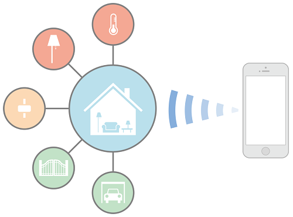
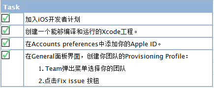
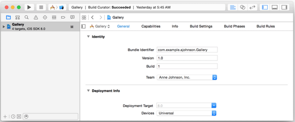

# 第一部分：简介 #

该文档旨在帮你编写 HomeKit app。HomeKit 库是用来沟通和控制家庭自动化配件的，这些家庭自动化配件都支持苹果的 HomeKit Accessory Protocol。HomeKit 应用程序可让用户发现兼容配件并配置它们。用户可以创建一些 action 来控制智能配件（例如恒温或者光线强弱），对其进行分组，并且可以通过 Siri 触发。HomeKit 对象被存储在用户 iOS 设备的数据库中，并且通过 iCloud 还可以同步到其他 iOS 设备。HomeKit  支持远程访问智能配件，并支持多个用户设备和多个用户。HomeKit 还对用户的安全和隐私做了处理。

 

`注意`：如果你是开发设计 HomeKit 硬件的供应商，你可以去
Hardware Developers 下的 [HomeKit](https://developer.apple.com/homekit/) 页面了解 MFi Program 相关信息，也可以阅读 [External Accessory Programming Topics](https://developer.apple.com/library/ios/featuredarticles/ExternalAccessoryPT/Introduction/Introduction.html#//apple_ref/doc/uid/TP40009502)。

另请参阅  

以下资源提供了更多关于创建HomeKit应用程序的信息：

• [HomeKit User Interface Guidelines](https://developer.apple.com/homekit/ui-guidelines/) 提供了用户界面设计指南  
• [App Store Review Guidelines: HomeKit](https://developer.apple.com/app-store/review/guidelines/#homekit) 提供了加快 app 审核的技巧  
• [HomeKit Framework Reference](https://developer.apple.com/library/ios/documentation/HomeKit/Reference/HomeKit_Framework/index.html#//apple_ref/doc/uid/TP40014519) 描述了 HomeKit 框架中的类和方法  
• [External Accessory Framework Reference](https://developer.apple.com/library/ios/documentation/ExternalAccessory/Reference/ExternalAccessoryFrameworkReference/index.html#//apple_ref/doc/uid/TP40008235) 列出了系统提供的发现和配置无线智能家居产品 UI  
• [HomeKit Catalog](https://developer.apple.com/library/ios/samplecode/HomeKitCatalog/Introduction/Intro.html#//apple_ref/doc/uid/TP40015048) 提供示例演示 HomeKit 特性    
• [WWDC 2014: Introducing HomeKit ](https://idmsa.apple.com/IDMSWebAuth/login.html?path=%2F%2Fvideos%2Fwwdc%2F2014%2F%3Fid%3D213&appIdKey=891bd3417a7776362562d2197f89480a8547b108fd934911bcbea0110d07f757)对 HomeKit 更高层次的分析    
• [iOS Security](https://www.apple.com/business/docs/iOS_Security_Guide.pdf) 描述 HomeKit 如何处理 iOS 上的安全和隐私  

# 第二部分：启用 HomeKit #

HomeKit 应用服务只提供给通过 App Store 发布的 app 应用程序。在你的 Xcode工 程中，HomeKit 应用程序需要额外的配置，你的 app 必须有开发证书和代码签名才能使用 HomeKit。在 Xcode 的 Capabilities 面板使用 HomeKit，可避免代码签名的问题。你无需直接在 Xcode 或者会员中心编辑授权文件（entitlements）。 
 
**设置**

为了完成本文档中所有步骤，你需要：

1. 一个安装 Xcode 6 或者Xcode 6 以上版本的 Mac 电脑。
2. 为了获得最佳体验，你的 Mac 电脑上最好安装最新的 OS X 系统和最新的 Xcode 版本。
3. 加 iOS 开发者计划。
4. 在 Member Center 拥有创建代码签名和资源配置的权限。

在你开始使用 HomeKit 之前，请确保你已经完成以下任务。创建你团队的配置文件（Provisioning Profile），请参阅：[App Distribution Quick Start](https://developer.apple.com/library/ios/documentation/IDEs/Conceptual/AppStoreDistributionTutorial/Introduction/Introduction.html#//apple_ref/doc/uid/TP40013839)。
  
 

当你成功地完成了之前的任务后，General 面板中 Team 弹出菜单中的错误信息和问题修复按钮将会消失。代码签名配置被成功创建后会展示下方的 General 面板。  

 

解决代码签名和证书配置问题，请参阅 [App Distribution Guide](https://developer.apple.com/library/ios/documentation/IDEs/Conceptual/AppDistributionGuide/Introduction/Introduction.html#//apple_ref/doc/uid/TP40012582) 文档中 [Troubleshooting](https://developer.apple.com/library/ios/documentation/IDEs/Conceptual/AppDistributionGuide/Troubleshooting/Troubleshooting.html#//apple_ref/doc/uid/TP40012582-CH5) 这一节。

**启用HomeKit**

想要使用 HomeKit，首先要启用它。Xcode 将会添加 HomeKit 权限到你的工程授权文件中和会员中心的 App ID 授权文件中，也会将 HomeKit 框架添加到你的工程中。HomeKit 需要一个明确的 App ID, 这个 App ID是为了你完成这些步奏而创建的。

启用HomeKit的步骤如下：  

1. 在 Xcode中，选择 View > Navigators > Show Project Navigator。
2. 从 Project/Targets 弹出菜单中 target（或者从 Project/Targets 的侧边栏）。
3. 点击 Capabilities 查看你可以添加的应用服务列表。
4. 滑到 HomeKit 所在的行并打开关。

**下载HomeKit Accessory Simulator**

无需为了开发 Homekit 应用程序而购买硬件产品。你可以使 HomeKit Accessory Simulator 来测试 HomeKit app 和模拟配件设备之间的通信。HomeKit Accessory Simulator 不是和 Xcode 一起发布的。 

下载 HomeKit Accessory Simulator 步骤如下：

1. 在Capabilities面板的HomeKit分区，点击Download HomeKit Accessory Simulator按钮。（或者选择 Xcode > Open Developer Tool > More Developer Tools）。
2. 在浏览器中搜索并且下载 "Hardware IO Tools for Xcode ".dmg 文件。
3. 在 Finder 中双击 ~/Downloads 中的 .dmg 文件。
4. 把 HomeKit Accessory Simulator 拖拽到 /Application 文件中。

之后，你将可以使用 HomeKit Accessory Simulator 测试你的 HomeKit 应用程序，正如 [Testing YourHomeKit App](https://developer.apple.com/library/ios/documentation/NetworkingInternet/Conceptual/HomeKitDeveloperGuide/TestingYourHomeKitApp/TestingYourHomeKitApp.html#//apple_ref/doc/uid/TP40015050-CH7-SW1) （第30页）中描述的那样。

